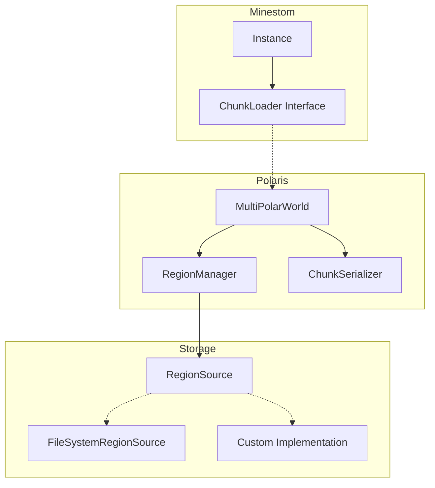
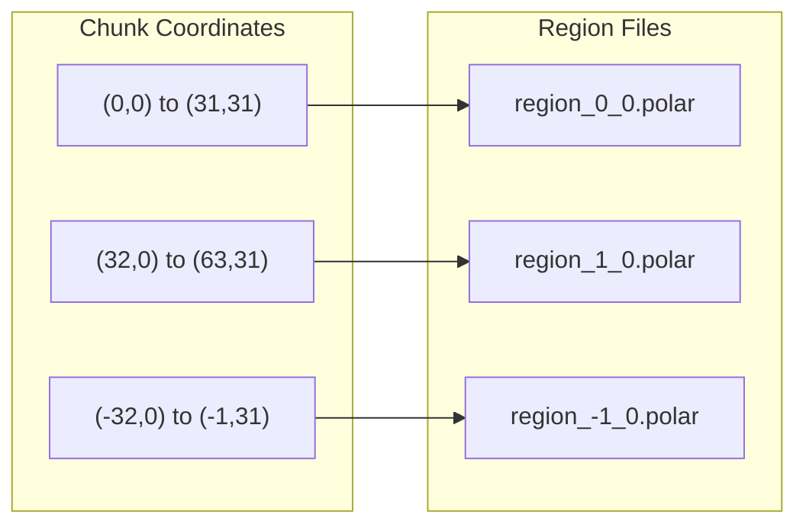
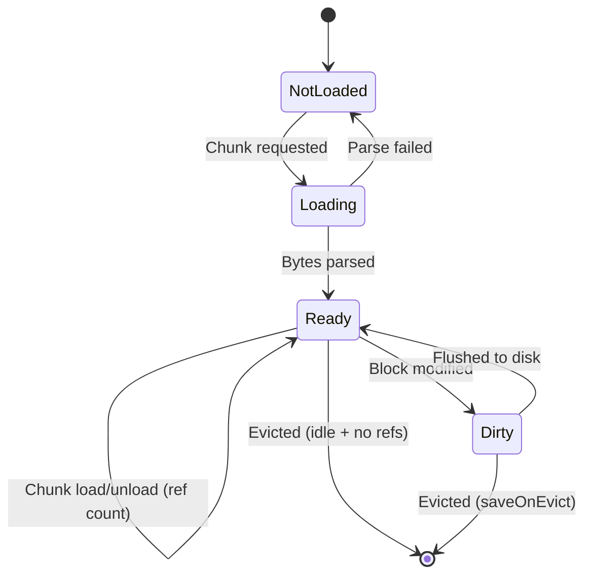

# Polaris

A multi-region Polar world loader for [Minestom](https://minestom.net/). Polaris transparently spans large worlds across multiple `.polar` files, loading and evicting regions on demand.

## Features

- **Lazy Loading** - Regions load only when chunks are requested
- **Automatic Eviction** - Idle regions are unloaded to save memory
- **Write Support** - Modified chunks are tracked and saved automatically
- **Thread Safe** - Concurrent chunk loading with request deduplication
- **Pluggable Storage** - Implement `RegionSource` for custom backends (S3, database, etc.)

## Architecture



## Installation

Add the dependency to your `build.gradle.kts`:

```kotlin
repositories {
    mavenCentral()
    // Add repository where polaris is published
}

dependencies {
    implementation("club.tesseract:polaris:0.1.0-beta")
}
```

## Quick Start

```java
import club.tesseract.polar.MultiPolarWorld;
import club.tesseract.polar.source.FileSystemRegionSource;

// Create the loader
MultiPolarWorld loader = MultiPolarWorld.builder()
    .source(new FileSystemRegionSource(Path.of("world/regions")))
    .regionSize(32)                          // 32x32 chunks per region file
    .evictAfter(Duration.ofMinutes(5))       // Unload idle regions after 5 min
    .saveInterval(Duration.ofMinutes(1))     // Auto-save dirty regions every 1 min
    .saveGeneratedChunks(true)               // Persist newly generated chunks
    .build();

// Attach to instance
InstanceContainer instance = instanceManager.createInstanceContainer();
instance.setGenerator(/* your generator */);
instance.setChunkLoader(loader);

// Hook events for ref counting (required for eviction)
loader.hook(instance);

// On shutdown
loader.close();
```

## Region Layout

Chunks are mapped to region files using floor division:



The formula:
```
regionX = Math.floorDiv(chunkX, regionSize)
regionZ = Math.floorDiv(chunkZ, regionSize)
filename = "region_<regionX>_<regionZ>.polar"
```

Using `floorDiv` ensures negative coordinates map correctly (chunk -1 goes to region -1, not region 0).

## Configuration

| Option | Default | Description |
|--------|---------|-------------|
| `source(RegionSource)` | *required* | Backend for reading/writing region files |
| `regionSize(int)` | 32 | Chunks per region side (32 = 1,024 chunks per file) |
| `evictAfter(Duration)` | 5 min | How long before idle regions are unloaded |
| `evictCheckInterval(Duration)` | 30 sec | How often to check for evictable regions |
| `saveInterval(Duration)` | 1 min | Auto-save interval (0 to disable) |
| `saveGeneratedChunks(boolean)` | false | Persist chunks created by Minestom's generator |
| `saveOnEvict(boolean)` | true | Save dirty regions before eviction |
| `worldAccess(PolarWorldAccess)` | null | Custom user data handler for chunks |

## Lifecycle



## Custom RegionSource

Implement `RegionSource` for custom storage backends:

```java
public class S3RegionSource implements RegionSource {

    @Override
    public CompletableFuture<Optional<byte[]>> read(RegionKey key) {
        return CompletableFuture.supplyAsync(() -> {
            String objectKey = "regions/region_" + key.x() + "_" + key.z() + ".polar";
            try {
                byte[] data = s3Client.getObject(bucket, objectKey);
                return Optional.of(data);
            } catch (NoSuchKeyException e) {
                return Optional.empty();
            }
        });
    }

    @Override
    public CompletableFuture<Void> write(RegionKey key, byte[] data) {
        return CompletableFuture.runAsync(() -> {
            String objectKey = "regions/region_" + key.x() + "_" + key.z() + ".polar";
            s3Client.putObject(bucket, objectKey, data);
        });
    }

    @Override
    public boolean supportsWrite() {
        return true;
    }

    @Override
    public CompletableFuture<List<RegionKey>> listAll() {
        // Optional: enables preloadAll()
        return CompletableFuture.supplyAsync(() -> {
            return s3Client.listObjects(bucket, "regions/")
                .stream()
                .map(this::parseKey)
                .flatMap(Optional::stream)
                .toList();
        });
    }
}
```

## API Reference

### MultiPolarWorld

| Method | Description |
|--------|-------------|
| `hook(Instance)` | Register chunk load/unload listeners (required) |
| `preloadRegion(x, z)` | Async load a specific region |
| `preloadAll()` | Load all regions from `listAll()` |
| `unloadRegion(x, z)` | Force-evict a region |
| `flush()` | Save all dirty regions |
| `flushSync()` | Save all dirty regions (blocking) |
| `close()` | Stop schedulers, flush, and cleanup |
| `getLoadedRegions()` | List of currently loaded region keys |
| `getDirtyRegions()` | List of regions with unsaved changes |
| `hasPendingChanges()` | True if any region needs saving |

## Known Limitations (Beta)

- **Biomes**: Currently hardcoded to `minecraft:plains` - actual biome data is not preserved
- **Block Entities**: Not serialized (chests, signs, etc. lose their contents)
- **Heightmaps**: Not fully implemented
- **Light Data**: Marked as missing - Minestom recalculates lighting

## License

MIT
